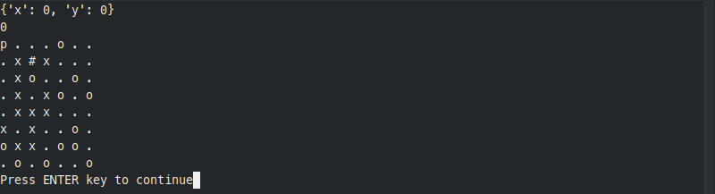

# pacman_project

## Requirements:
- Python 3
- Linux (if you want to rebuild)
- A C++ compiler (e.g: g++)

## Usage
- First we must build the C++ program using some type of C++ compiler. **The binary file path has to be ./bin/Pac_man**
```sh
g++ -o ./bin/Pac_man pacman.cpp main.cpp
```

- Then we install necessary python libraries
```sh
pip install click
```
or like this (depend on system setup)
```sh
pip3 install click
```

- Run visualize.py with python 3.6
```sh
python visualize.py
```
or like this (depend on system setup) 
```sh
python3 visualize.py
```

- Then you can provide path to input file you want to test, choose which level to run, and which display method to use
- Screenshots:


